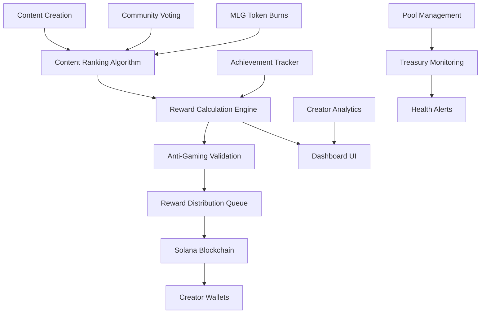

# MLG.clan Content Reward System

## Overview

The MLG.clan Content Reward System is a comprehensive blockchain-based reward distribution platform designed specifically for gaming content creators. Built on Solana, it provides automated, fair, and transparent reward distribution based on content performance, engagement metrics, and community achievement milestones.

## Key Features

### 🎯 Performance-Based Rewards
- **Multi-tier Reward Structure**: Base rewards scale with content quality and engagement
- **Engagement Bonuses**: Additional rewards for high engagement rates, viral content, and completion metrics
- **Gaming-Specific Scoring**: Specialized metrics for esports content, competitive gameplay, and skill levels
- **Progressive Token Weighting**: MLG token burns increase vote impact with 1-4 token progressive pricing

### 🏆 Achievement System
- **Content Milestones**: First viral content, community favorites, engagement masters
- **Community Impact**: Helpful creator, trend setter, mentor recognition
- **Gaming Achievements**: Esports legend, skill master, multi-game creator
- **Creator Tier Progression**: Standard → Rising Star → Established → Clan Leader → Verified

### 🛡️ Anti-Gaming & Security
- **Account Age Requirements**: Minimum 7-day account age for reward eligibility
- **Vote Pattern Analysis**: Detection of unusual voting behaviors and bot activity
- **Content Similarity Checks**: Prevention of duplicate content rewards
- **Daily Reward Limits**: Maximum 3 rewards per creator per day with cooling periods
- **Appeals Process**: Community-driven dispute resolution system

### 💰 Automated Distribution
- **Solana Integration**: Direct MLG token transfers to creator wallets
- **Batch Processing**: Efficient reward distribution with transaction confirmation
- **Real-time Balance Tracking**: Live treasury and individual balance monitoring
- **Gas Optimization**: Minimal transaction fees with batch processing

### 📊 Analytics & Insights
- **Creator Dashboards**: Comprehensive earnings analytics and performance metrics
- **Reward Predictions**: AI-powered earning estimates and growth potential analysis
- **Pool Health Monitoring**: Treasury balance, burn rates, and utilization tracking
- **Historical Trends**: Performance tracking over time with actionable insights

## Architecture



## Core Components

### 1. ContentRewardSystem
Main reward calculation and distribution engine.

```javascript
import { ContentRewardSystem } from './content-rewards.js';

const rewardSystem = new ContentRewardSystem();
const rewardResult = await rewardSystem.calculateContentReward(content);
```

### 2. RewardAnalytics
Comprehensive analytics and reporting system.

```javascript
import { RewardAnalytics } from './content-rewards.js';

const analytics = new RewardAnalytics(rewardSystem);
const report = analytics.generateAnalyticsReport({ timeframe: 'month' });
```

### 3. Creator Dashboard UI
React component for creator reward interfaces.

```javascript
import CreatorRewardsDashboard from './ui/components/creator-rewards-dashboard.js';

<CreatorRewardsDashboard 
  creatorId="creator_123"
  walletAddress="7XJiwLDrjzxDYdZipnJXzpr1iDTmK55XixSFAa7JgNEL"
/>
```

## Configuration

### Reward Pool Settings
```javascript
REWARD_POOLS: {
  DAILY: {
    TOTAL_ALLOCATION: 10000,  // 10,000 MLG tokens per day
    DISTRIBUTION_PERIODS: 24,  // Hourly distribution
    MINIMUM_THRESHOLD: 100,   // Minimum score to qualify
    TOP_PERCENTAGE: 0.1       // Top 10% get rewards
  },
  WEEKLY: {
    TOTAL_ALLOCATION: 50000,  // 50,000 MLG tokens per week
    TOP_PERCENTAGE: 0.05      // Top 5% get rewards
  },
  MONTHLY: {
    TOTAL_ALLOCATION: 200000, // 200,000 MLG tokens per month
    TOP_PERCENTAGE: 0.02      // Top 2% get rewards
  }
}
```

### Performance Rewards
```javascript
PERFORMANCE_REWARDS: {
  VOTE_SCORE: {
    EXCELLENT: { threshold: 100, multiplier: 2.0, baseReward: 500 },
    GREAT: { threshold: 50, multiplier: 1.5, baseReward: 250 },
    GOOD: { threshold: 20, multiplier: 1.2, baseReward: 100 },
    DECENT: { threshold: 10, multiplier: 1.0, baseReward: 50 }
  },
  ENGAGEMENT: {
    VIRAL_THRESHOLD: 10000,     // 10k+ views = viral
    VIRAL_BONUS: 1000,          // 1000 MLG bonus
    ENGAGEMENT_RATE_BONUS: {
      HIGH: { threshold: 0.15, bonus: 500 },    // 15%+ engagement
      MEDIUM: { threshold: 0.08, bonus: 200 },  // 8%+ engagement
      LOW: { threshold: 0.03, bonus: 50 }       // 3%+ engagement
    }
  }
}
```

### Creator Tiers
```javascript
CREATOR_TIERS: {
  VERIFIED: { multiplier: 1.5, baseBonus: 200 },
  CLAN_LEADER: { multiplier: 1.3, baseBonus: 150 },
  ESTABLISHED: { multiplier: 1.2, baseBonus: 100 },
  RISING_STAR: { multiplier: 1.1, baseBonus: 50 }
}
```

## Usage Examples

### Basic Reward Calculation
```javascript
const content = {
  id: 'viral_ace_clip_001',
  title: 'Insane 1v5 Ace Clutch - Valorant Champions',
  creator: {
    id: 'pro_player_123',
    walletAddress: '7XJiwLDrjzxDYdZipnJXzpr1iDTmK55XixSFAa7JgNEL',
    verified: true,
    clanStatus: 'verified'
  },
  views: 25000,
  likes: 3200,
  mlgVotes: { upvotes: 150, totalTokensBurned: 45 },
  analytics: { completionRate: 0.92, engagementRate: 0.18 }
};

const rewardResult = await rewardSystem.calculateContentReward(content);

if (rewardResult.eligible) {
  console.log(`Reward: ${rewardResult.totalReward} MLG tokens`);
  // Distribute reward
  await rewardSystem.distributeRewards([{
    recipient: content.creator.walletAddress,
    amount: rewardResult.totalReward,
    contentId: content.id,
    type: 'performance'
  }]);
}
```

### Achievement Rewards
```javascript
const achievement = await rewardSystem.calculateAchievementReward(
  creator,
  'FIRST_VIRAL',
  { contentId: 'viral_clip_123', views: 12000 }
);

console.log(`Achievement: ${achievement.description} (+${achievement.amount} MLG)`);
```

### Creator Dashboard
```javascript
const dashboard = await rewardSystem.getCreatorDashboard(creatorId);

console.log(`Total Earnings: ${dashboard.earnings.total} MLG`);
console.log(`Rank: #${dashboard.earnings.rank}`);
console.log(`Next Reward: ${dashboard.predictions.nextReward.estimated} MLG`);
```

### Pool Health Monitoring
```javascript
const poolHealth = await rewardSystem.getRewardPoolHealth();

console.log(`Treasury: ${poolHealth.treasuryBalance} MLG`);
console.log(`Daily Burn: ${poolHealth.runway.dailyBurnRate} MLG`);
console.log(`Runway: ${poolHealth.runway.estimatedDays} days`);
console.log(`Status: ${poolHealth.runway.status}`);
```

## Integration Points

### Content Ranking Algorithm
The reward system integrates with the existing content ranking algorithm to:
- Use normalized content scores (0-100) for reward tier determination
- Apply gaming-specific multipliers based on game popularity and content type
- Factor in user reputation and clan status for reward calculations

### Voting System
MLG token burn-to-vote integration provides:
- Progressive vote weighting (1-4 MLG tokens per additional vote)
- Vote velocity bonuses for rapidly trending content
- Anti-gaming detection for unusual voting patterns

### Phantom Wallet
Secure wallet integration enables:
- Direct MLG token transfers to creator wallets
- Transaction simulation before execution for safety
- Real-time balance tracking and confirmation
- Mobile-responsive connection flows

## Security Considerations

### Anti-Gaming Measures
1. **Account Age Verification**: 7-day minimum account age
2. **Content Quality Thresholds**: Minimum 30/100 quality score
3. **Daily Limits**: Maximum 3 rewards per creator per day
4. **Cooling Periods**: 24-hour minimum between rewards
5. **Pattern Analysis**: Vote and behavior pattern detection
6. **Content Similarity**: Duplicate content prevention

### Solana Security
1. **Transaction Simulation**: All transactions simulated before execution
2. **Gas Estimation**: 20% buffer added to prevent failures
3. **Retry Mechanisms**: 3 retry attempts for failed transactions
4. **Confirmation Timeouts**: 60-second timeout for confirmations
5. **Treasury Security**: Multi-signature treasury management

### Appeals Process
1. **7-Day Appeal Window**: Creators can dispute reward decisions
2. **Evidence Requirements**: Support documentation for appeals
3. **Community Voting**: 60% approval needed for appeal success
4. **Automatic Reinstatement**: 80% approval = immediate reinstatement

## Monitoring & Analytics

### System Health
- **Treasury Balance**: Real-time MLG token balance tracking
- **Burn Rates**: Daily, weekly, monthly token distribution rates
- **Pool Utilization**: Percentage of allocated rewards distributed
- **Transaction Success**: Success/failure rates for reward distributions

### Creator Analytics
- **Earnings Tracking**: Individual creator reward history and trends
- **Performance Metrics**: Content quality scores and engagement rates
- **Predictions**: AI-powered earning estimates and recommendations
- **Ranking Systems**: Creator leaderboards and percentile rankings

## API Reference

### Core Methods

#### `calculateContentReward(content, options)`
Calculates reward amount for content based on performance metrics.

**Parameters:**
- `content` (Object): Content object with creator, metrics, and analytics
- `options` (Object): Optional calculation parameters

**Returns:**
- `eligible` (Boolean): Whether content qualifies for rewards
- `totalReward` (Number): Total MLG tokens to distribute
- `breakdown` (Object): Detailed reward component breakdown
- `recommendations` (Array): Suggestions for creator improvement

#### `distributeRewards(rewardsList, options)`
Distributes MLG tokens to creator wallets via Solana blockchain.

**Parameters:**
- `rewardsList` (Array): Array of reward objects to distribute
- `options` (Object): Distribution options (batch size, retry attempts)

**Returns:**
- `successful` (Array): Successfully distributed rewards
- `failed` (Array): Failed reward distributions with error details
- `totalAmount` (Number): Total MLG tokens distributed
- `transactionIds` (Array): Solana transaction signatures

#### `getCreatorDashboard(creatorId, options)`
Generates comprehensive creator analytics and dashboard data.

**Parameters:**
- `creatorId` (String): Unique creator identifier
- `options` (Object): Dashboard options (timeframe, metrics)

**Returns:**
- `earnings` (Object): Total earnings, rank, percentile
- `performance` (Object): Content metrics and engagement rates
- `predictions` (Object): Future earning estimates
- `trends` (Object): Historical performance trends
- `recommendations` (Array): Personalized improvement suggestions

## Testing

Run the comprehensive test suite:

```bash
npm test -- src/content/content-rewards.test.js
```

Run integration examples:

```bash
node src/content/content-rewards-integration-example.js
```

## Deployment

### Environment Variables
```bash
SOLANA_NETWORK=mainnet-beta
MLG_TOKEN_ADDRESS=7XJiwLDrjzxDYdZipnJXzpr1iDTmK55XixSFAa7JgNEL
TREASURY_WALLET_PRIVATE_KEY=your_private_key_here
RPC_ENDPOINT=https://api.mainnet-beta.solana.com
```

### Production Checklist
- [ ] Treasury wallet properly funded
- [ ] MLG token contract verified
- [ ] Anti-gaming thresholds calibrated
- [ ] Pool allocation limits set
- [ ] Monitoring alerts configured
- [ ] Backup systems operational

## Support

For technical support or questions about the reward system:
- Review the integration examples in `content-rewards-integration-example.js`
- Check the comprehensive test suite for usage patterns
- Monitor system health via the dashboard components

## License

Part of the MLG.clan gaming platform. Proprietary software with Solana blockchain integration.

---

**MLG Token Contract**: `7XJiwLDrjzxDYdZipnJXzpr1iDTmK55XixSFAa7JgNEL`  
**Network**: Solana Mainnet  
**Version**: 1.0.0 - Production Ready